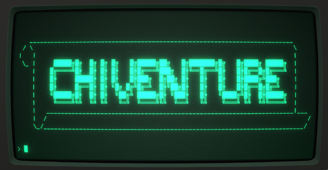

# chiventure

[](https://www.youtube.com/watch?v=DGSXURPvRxY)

chiventure is a text adventure game engine. In other words, chiventure is not an individual game but, rather, a platform that allows game authors to develop text adventure games using WDL (World Description Language) files.

## Building chiventure

chiventure uses CMake. To build, run
```
mkdir build
cd build
cmake ..
```

#### Dependencies

chiventure depends on `JSON-C`, `Curses`, and `criterion`. CMake will warn if any of these are not installed with an error of the form "Could NOT find `<library>`"

If you are missing any of the libraries, see [docs/dependencies.md](/docs/dependencies.md) for information on how to install them

## Running chiventure

To run chiventure with a WDL file, run:
```
./chiventure <path_to_wdl_file>
``` 

To try a sample game, from inside the build directory, run 
```
./chiventure ../tests/wdl/examples/wdl/connected-rooms.wdl
```

Once inside chiventure, you can type `HELP` for the list of available commands.

You can also run chiventure without specifying a WDL file:

```
./chiventure
```

However, at the moment, it is not possible to load a WDL file from inside chiventure.

## Writing a Chiventure Game

To write a game in chiventure, see [wdl.md](/docs/wdl.md) for a specification of the WDL language.

Example games can be found in `tests/wdl/examples/`, such as [test.wdl](/tests/wdl/examples/test.wdl)

## Developer Resources

* [Documentation](/docs/README.md)
* [Developer Guidelines](/docs/developer.md)
* [Actions Specification](/docs/actions.md)
