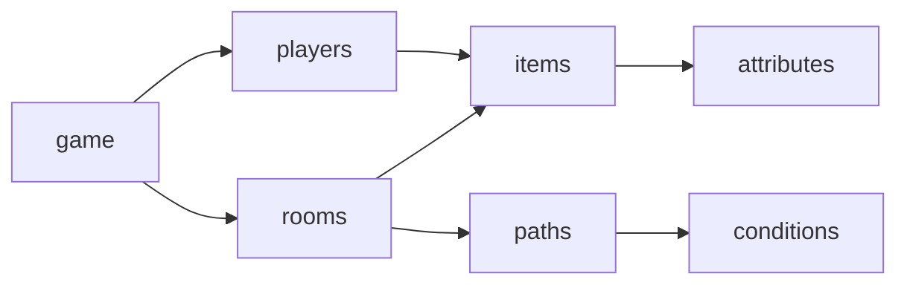

# Game-State Documentation

## Intro

Hello and welcome to game-state and the lit times that will follow! We’re responsible for changing, (as the name perhaps hinted) at changing the state of the game and modifying the structs.

The workflow that we’re in charge of looks a bit like this:

WDL -> Game-state (which is then used by Action Management/Checkpointing/UI)

Action Management -> Game-state (once an action is legal, we provide the functionality that modifies the game state. Eg move room, add object to inventory, etc)

Game-stat -> Checkpointing (serializing and de-serializing the game-state)

##
Updates:

Sprint 1 - Designed initial structs/designs

Sprint 2 - Expanded designs/functionality to include directionality, began functions to modify and construct game states.

## Overall Game Structure
The following is the tenative game structure (we will implement other features like actions in the next sprint). We will specify each part in the next sections.

 players -> items -> attributes;  
   game -> rooms -> items;  
   rooms -> paths -> conditions;  
 }  
'/>

## Game module
### Structs
The game module contains a hashtable of **players** and a hashtable of **rooms** (that being said, other teams do not need to know it is implemented with hashtable; it is just a iteratable list of players; other teams do not even need to type and words containing "hash" in their programs; same for all the subsequent modules).

In this sense, everything related to the current game should be stored in this game struct in memory, and is accessible with functions we provided, but other teams should be responsible for checking if each operation they make is legal.

There is also a time_start field, but it does not have specific functionalily right now, so we commented it out.

    typedef struct game {
        /* an iteratable hashtable of players */
        /* using the macros provided in uthash.h */
        /* the expected size is 1 for single player games but this can change */
        player_hash_t all_players;

        /* an iteratable hashtable of rooms */
        /* using the macros provided in uthash.h */
        room_hash_t all_rooms;

        /* pointer to current room struct */
        room_t *curr_room;

        /* pointer to current player struct */
        room_t *curr_player;

        /* time when game started */
        //int time_start;
    } game_t;

### Functions

    game_t *game_new();
+ Parameters:
    - none
+ Returns:
    - a new game struct

This functions mallocs space for a new game struct. It does not take any arguments but only creates a new game without rooms and players.

    int game_free(game_t *game);

+ Parameters:
     - game struct that needs to be freed
+ Returns:
     - 1 if successful, 0 if failed

 Frees everything in the game struct safely.

    void game_quit(game_t *game);
+ Parameters:
     - game struct
+ Returns:
     - none

Exits game safely (frees all memory before exits).

    void move_to_room(game_t *game, room_t *new_room);
+ Parameters:
     - game struct
     - room that we're changing to
+ Returns:
     - none

Given the pointer to another room, changes the current room in game-state. This function does NOT check if the move is legal.
