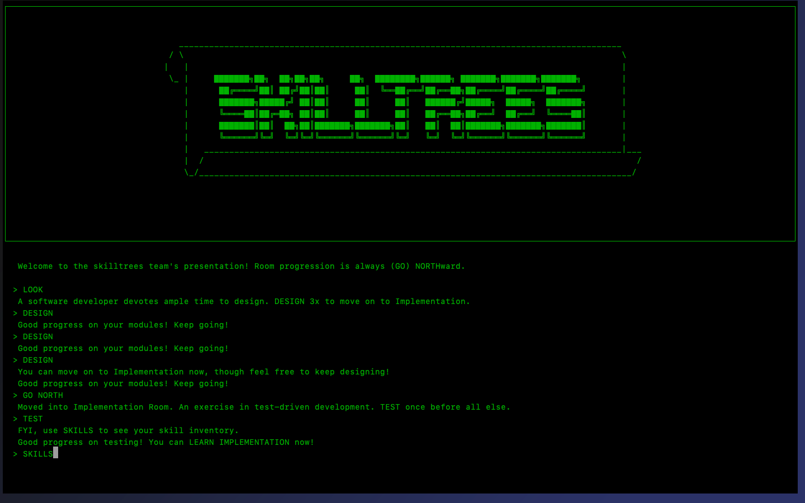

# Skill Trees Demo Game
This example program runs a complete instance of chiventure to feature skill
trees. The context for this chiventure game is software development, represented
by three rooms: the "Design Room," the "Implementation Room," and the "Demo
Room."



In running this game, one begins with just one skill in their inventory, the
"Design Skill." The Design Skill is leveled up with each use, and one can enter
the Implementation Room only after having used (leveled up) the Design Skill at
least 3x. Leveling up the Design Skill 3x also grants the player a subsequent
"Testing Skill."

The Implementation Room models test-driven development: one cannot
"LEARN IMPLEMENTATION", until one has used (leveled up) their Testing Skill at
least once. Having both tested at least once and having learned implementation,
one can use the "Implementation Skill." The Implementation Skill must be used at
least twice to be granted access to the final room, the Demo Room.

## CLI Operations in the Demo Game
* `LOOK`, for gathering information about a room
* `GO NORTH`, to progress to the next room in the game sequence
* `GO SOUTH`, to go back to a previous room in the game sequence
* `SKILLS`, for listing all skills currently in your skill inventory

* `DESIGN`, for using the Design Skill

* `TEST`, for using the Testing Skill

* `LEARN IMPLEMENTATION`, for learning the Implementation Skill
* `LOOK IMPLEMENTATION`, for inspecting the Implementation Skill
* `IMPLEMENT`, for using the Implementation Skill

## Running the Demo Game
1. Clone the chiventure repo into your folder of choice.
    ```
    $ git clone https://github.com/uchicago-cs/chiventure.git
    ```
2. Change directories.
    ```
    $ cd chiventure
    ```
3. Build chiventure.
    ```
    $ mkdir build
    $ cd build
    $ cmake ..
    $ make
    ```
4. Compile the executable (from within the top-level `build` directory).
    ```
    $ cd src/skilltrees/examples
    $ make
    ```
5. Run the demo game!
    ```
    $ ./skilltrees_presentation
    ```
